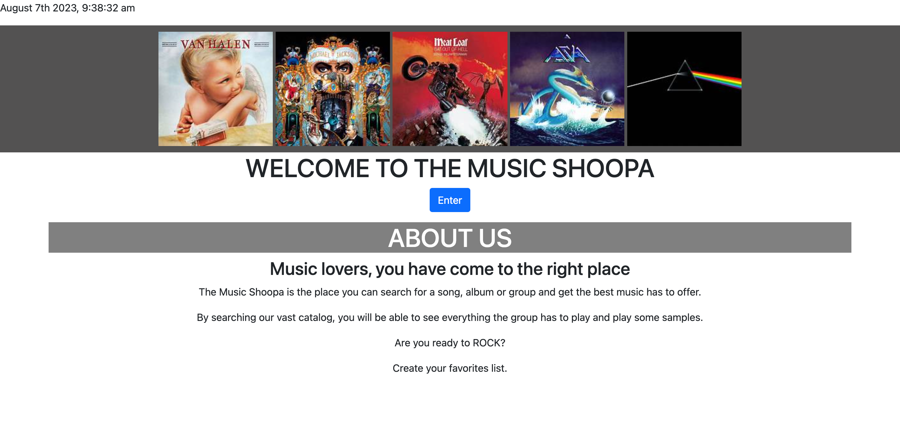
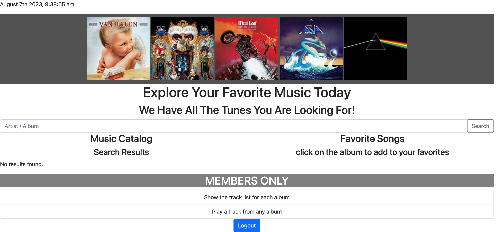

# Project 2
Project 2 Challenge

## Music Shoppa Search

* AS a music lover

* I WANT to be able to create a page where the user can search for their favorite artist and get a list of albums

* SO THAT the user can add to a favorite list and be able to remove any album they have added. 

## Acceptance Criteria

* GIVEN a command-line application that accepts user input

* WHEN I start the application

* THEN the user is presented with a login page to either login or create an account

* WHEN the user searches for their favorite artist

* THEN the user is presented with the albums by that artist

* WHEN the user clicks the add button

* THEN the user can add their favorite album by that artist to a favorite list

* WHEN the user adds to the favorite list, they are able to remove or add more albums

## Resources

* W3schools.org

* Code Academy

* YouTube videos for coding help

* GitHub 

* Stackoverflow to answer questions on coding

## Assets

